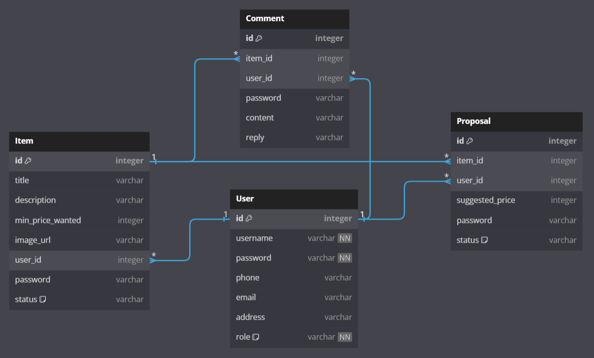

# LIKELION-MissionTypeProject-1st

---
## ♻️멋사마켓♻️️(심화)


> **개인 미션형 프로젝트** <br/> **제작자: 권선녀** [@sssssn](https://github.com/sssssn) <br/> **제작 기간: 2023.07.26 ~ 2023.08.02**

## 프로젝트 소개 🦁
**[지난 미니 프로젝트](README_old.md)를 고도화하는 작업**으로, 중고 제품 거래 플랫폼의 백엔드를 보다 상세하게, 복합적으로 만들어 보는 미션형 프로젝트입니다. </br>
1. 인증된 사용자가 중고 물품을 자유롭게 올리고
2. 댓글을 통해 소통하며
3. 최종적으로 구매 제안에 대하여 수락할 수 있으며 이에 대한 정보는 안전하게 관리될 수 있는 형태

---
## 시작 가이드 🌈
### Environments
For building and running the project you need:

- IntelliJ Ultimate
- Spring Boot 3.1.1
    - Build Tool: Gradle
    - Dependencies:
        - Spring Boot DevTools
        - Lombok
        - Spring Web
        - Spring Data JPA
        - Spring Boot Starter Security
        - Spring Boot Starter Thymeleaf
        - Spring Boot Starter Validation
        - JSON Web Token for Java (jjwt)

---
## Stacks 👩🏻‍💻
### Environment


### Development


 <br/>


### Communication


---
## 향상된 기능 🌟

### 1️⃣ 사용자 인증 (Authentication)
- 사용자의 신원을 확인하는 것을 목적으로 [토큰 기반 인증 시스템](https://github.com/likelion-backend-5th/Project_1_KwonSunNyeo/commits/day1) 구현
- 사용자의 로그인 상태에 따라 접근 권한이 다르게 적용
- 로그인 성공 시 사용자에게 토큰을 제공하며, 이후 요청 시 토큰을 이용하여 인증
- <details>
    <summary>💡상세 구현 내용</summary>

  - `UserController` 를 통해 로그인, 로그아웃, 회원가입 기능 구현 
  - `UserEntity` 를 통해 사용자 인증 정보를 데이터베이스에 저장하기 위한 엔티티 클래스 생성 
  - `UserRepository` 를 통해 JPA를 이용한 사용자 관리 기능과 사용자 이름으로 정보 로드 기능 추가 
  - `JwtTokenUtils` `JwtTokenFilter` 를 통해 JWT 토큰 인증 및 필터 기능 추가
</details>

- <details>
    <summary>🛠️트러블 슈팅</summary>

  - **문제**: WebSecurityConfig 추가 후에 지속적으로 "리다이렉션 횟수 초과" 에러 발생.
  - **해결 과정 및 해결책**: 이 문제를 해결하기 위해 매우 오랜 시간동안 코드를 수정하고 검색했으나 동일한 문제가 다른 브라우저에서도 계속 발생하여 새로운 프로젝트를 생성하여 코드 비교 결과, 문제는 특정 종속성 때문에 발생했다는 사실을 발견하여 추가.
    ```groovy
      implementation 'org.springframework.boot:spring-boot-starter-thymeleaf'
      implementation 'org.thymeleaf.extras:thymeleaf-extras-springsecurity6'
      testImplementation 'org.springframework.security:spring-security-test'
    ```
</details>

### 2️⃣ 관계 설정 (Relationship)
- 사용자와 물품, 댓글, 제안 간의 [관계 설정](https://github.com/likelion-backend-5th/Project_1_KwonSunNyeo/commits/day2)을 통해 데이터의 논리적 연결성 강화
- 각 사용자는 여러 개의 물품, 댓글, 제안을 가질 수 있으며, 이들 간의 관계는 데이터베이스 상에서 표현
  - **ERD** (Entity Relationship Diagram) <br/> 
- <details>
    <summary>💡상세 구현 내용</summary>

    - `Item, Comment, Proposal, UserEntity` 를 통해 각 엔티티 사이의 관계 설정
    - `*Dto` 수정, 사용자 검증 및 getId() 방식 변경
    - `*Service` `*Repository` 를 통해 사용자 검증 방식 변경, 예외 메시지 개선, findByIdAndUser 메서드 추가
    - `*Controller` 를 통해 create, update, delete 메서드의 파라미터 변경
</details>

- <details>
    <summary>🛠️트러블 슈팅</summary>

    - **문제**: 커밋 메시지를 수정하면서 VI 에디터를 자주 사용하게 되었는데, 에디터를 종료할 때 마다 ESC → :wq가 제대로 작동하지 않고 ESC 키를 누르면 코드 에디터 창으로 이동하는 문제 발생.
    - **해결 과정 및 해결책**: 인텔리제이 설정 -> 도구 -> 터미널 -> 터미널 키 바인딩 구성 -> 에디터로 포커스 전환 -> Escape 제거 기능을 통해 해결.
</details>

### 3️⃣ 기능 접근 설정 (Access Control)
- 사용자의 로그인 상태 및 권한에 따라 서비스 내의 [기능 접근 제어](https://github.com/likelion-backend-5th/Project_1_KwonSunNyeo/commits/day3) 구현
- 사용자는 자신이 등록한 물품, 작성한 댓글 및 제안에 대해서만 수정 및 삭제 권한 적용
- <details>
    <summary>💡상세 구현 내용</summary>

    - `Role` `CustomUserDetails` 를 통해 사용자 역할 및 권한 구분 기능 구현, JWT 토큰에 권한 정보 추가 
    - `WebSecurityConfig` 를 통해 권한에 따른 접근 제한 설정 추가 
    - `UserController` 를 통해 회원가입, 로그인, 보안 URL 접근 기능 구현
    - `*Dto` `*Controller` 를 통해 DTO 유효성 검증 규칙 추가, 컨트롤러 메서드 수정, 응답 DTO 및 반환 메시지 통일
</details>

- <details>
    <summary>🛠️트러블 슈팅</summary>

    - **문제**: JWT 토큰 발급 및 필터 기능과 포스트맨에서 동일한 URL로 정상적으로 작동하였으나, 웹 환경(localhost:8080/users/login)에서 직접 테스트 시에는 로컬 스토리지에 JWT 토큰이 저장되지 않는 문제 발생.
    - **해결 과정 및 해결책**: `console.log(data);` 코드를 통해 서버에서 반환되는 응답 전체를 출력하여 이를 통해 반환 메시지가 `"로그인 되었습니다. 토큰은 " + jwtToken.getToken() + " 입니다."` 로 설정되어 있어서 토큰을 제대로 불러오지 못했다는 사실을 확인하여 반환 메시지에서 토큰 값을 추출.
      ```javascript
        var token = message.split(' ')[3]; // '로그인 되었습니다. 토큰은 {토큰 값} 입니다.'에서 {토큰 값} 추출
      ```
</details>

### 4️⃣ UI 구현 (User Interface)
- 사용자가 서비스를 더 쉽게 이해하고 사용할 수 있도록 [UI](https://github.com/likelion-backend-5th/Project_1_KwonSunNyeo/commits/day4) 구현 
- 회원가입 및 로그인 폼을 통해 사용자 정보를 입력하고 이를 서비스 내에서 사용
- <details>
    <summary>💡상세 구현 내용</summary>

    - `login-form` `my-profile` `register-form` 를 통해 포스트맨과 로컬 테스트 동시에 가능하도록 ajax를 이용한 웹 인터랙션 구현
    - `UserController` 를 통해 로그인 응답의 토큰 포함 방식 개선
</details>

- <details>
    <summary>🛠️트러블 슈팅</summary>

    - **문제**: 특정 URL(localhost:8080/users/my-profile)에 대한 접근이 제한되어 403에러 발생. JWT 토큰 발급, 저장 과정은 정상적으로 작동하며 포스트맨에서 동일한 URL로 정상적으로 작동하였으나, 웹에서 접근 시 URL(/users/my-profile)에 대한 접근이 제한되어 403에러 발생.
    - **해결 과정 및 해결책**: JWT 토큰 발급과 저장 과정 및 포스트맨에서 동일한 URL로 정상적으로 작동하였으나, 웹 환경에서만 에러가 발생되어 CORS 설정도 추가했음에도 불구하고 해결되지 않았음.
</details>

#### 📑 URL 모음
1. [회원가입](http://localhost:8080/users/register)
2. [로그인](http://localhost:8080/users/login)
3. [마이 프로필](http://localhost:8080/users/my-profile) ⚠️ 403에러 발생
4. [포스트맨 API 문서](https://documenter.getpostman.com/view/28055949/2s9XxvTanX)

---
## Architecture 📦

### 디렉토리 구조
<details>
<summary>여기를 눌러주세요!🌱</summary>

```bash
📦market
 ┣ 📂gradle
 ┃ ┗ 📂wrapper
 ┃ ┃ ┣ 📜gradle-wrapper.jar
 ┃ ┃ ┗ 📜gradle-wrapper.properties
 ┣ 📂src
 ┃ ┣ 📂main
 ┃ ┃ ┣ 📂java
 ┃ ┃ ┃ ┗ 📂com
 ┃ ┃ ┃ ┃ ┗ 📂likelion
 ┃ ┃ ┃ ┃ ┃ ┗ 📂market
 ┃ ┃ ┃ ┃ ┃ ┃ ┣ 📂controller
 ┃ ┃ ┃ ┃ ┃ ┃ ┃ ┣ 📜ItemController.java
 ┃ ┃ ┃ ┃ ┃ ┃ ┃ ┣ 📜CommentController.java
 ┃ ┃ ┃ ┃ ┃ ┃ ┃ ┣ 📜ProposalController.java
 ┃ ┃ ┃ ┃ ┃ ┃ ┃ ┗ 📜UserController.java
 ┃ ┃ ┃ ┃ ┃ ┃ ┣ 📂dto
 ┃ ┃ ┃ ┃ ┃ ┃ ┃ ┣ 📜ItemDto.java
 ┃ ┃ ┃ ┃ ┃ ┃ ┃ ┣ 📜CommentDto.java
 ┃ ┃ ┃ ┃ ┃ ┃ ┃ ┣ 📜CommentPageDto.java
 ┃ ┃ ┃ ┃ ┃ ┃ ┃ ┣ 📜ItemPageDto.java
 ┃ ┃ ┃ ┃ ┃ ┃ ┃ ┣ 📜ItemReadDto.java
 ┃ ┃ ┃ ┃ ┃ ┃ ┃ ┣ 📜ProposalDto.java
 ┃ ┃ ┃ ┃ ┃ ┃ ┃ ┣ 📜ProposalPageDto.java
 ┃ ┃ ┃ ┃ ┃ ┃ ┃ ┣ 📜ResponseDto.java
 ┃ ┃ ┃ ┃ ┃ ┃ ┃ ┣ 📜UserDto.java
 ┃ ┃ ┃ ┃ ┃ ┃ ┃ ┗ 📜UserProfileDto.java
 ┃ ┃ ┃ ┃ ┃ ┃ ┣ 📂entity
 ┃ ┃ ┃ ┃ ┃ ┃ ┃ ┣ 📜ItemEntity.java
 ┃ ┃ ┃ ┃ ┃ ┃ ┃ ┣ 📜ItemStatus.java
 ┃ ┃ ┃ ┃ ┃ ┃ ┃ ┣ 📜CommentEntity.java
 ┃ ┃ ┃ ┃ ┃ ┃ ┃ ┣ 📜ProposalEntity.java
 ┃ ┃ ┃ ┃ ┃ ┃ ┃ ┣ 📜ProposalStatus.java
 ┃ ┃ ┃ ┃ ┃ ┃ ┃ ┣ 📜UserEntity.java
 ┃ ┃ ┃ ┃ ┃ ┃ ┃ ┗ 📜Role.java
 ┃ ┃ ┃ ┃ ┃ ┃ ┣ 📂repository
 ┃ ┃ ┃ ┃ ┃ ┃ ┃ ┣ 📜ItemRepository.java
 ┃ ┃ ┃ ┃ ┃ ┃ ┃ ┣ 📜CommentRepository.java
 ┃ ┃ ┃ ┃ ┃ ┃ ┃ ┣ 📜ProposalRepository.java
 ┃ ┃ ┃ ┃ ┃ ┃ ┃ ┗ 📜UserRepository.java
 ┃ ┃ ┃ ┃ ┃ ┃ ┣ 📂service
 ┃ ┃ ┃ ┃ ┃ ┃ ┃ ┣ 📜ItemService.java
 ┃ ┃ ┃ ┃ ┃ ┃ ┃ ┣ 📜CommentService.java
 ┃ ┃ ┃ ┃ ┃ ┃ ┃ ┣ 📜JpaUserDetailsManager.java
 ┃ ┃ ┃ ┃ ┃ ┃ ┃ ┗ 📜ProposalService.java
 ┃ ┃ ┃ ┃ ┃ ┃ ┣ 📂config
 ┃ ┃ ┃ ┃ ┃ ┃ ┃ ┗ 📜WebSecurityConfig.java
 ┃ ┃ ┃ ┃ ┃ ┃ ┣ 📂domain
 ┃ ┃ ┃ ┃ ┃ ┃ ┃ ┗ 📜CustomUserDetails.java
 ┃ ┃ ┃ ┃ ┃ ┃ ┣ 📂jwt
 ┃ ┃ ┃ ┃ ┃ ┃ ┃ ┣ 📜JwtRequestDto.java
 ┃ ┃ ┃ ┃ ┃ ┃ ┃ ┣ 📜JwtTokenDto.java
 ┃ ┃ ┃ ┃ ┃ ┃ ┃ ┣ 📜JwtTokenFilter.java
 ┃ ┃ ┃ ┃ ┃ ┃ ┃ ┗ 📜JwtTokenUtils.java
 ┃ ┃ ┃ ┃ ┃ ┃ ┗ 📜MarketApplication.java
 ┃ ┃ ┣ 📂resources
 ┃ ┃ ┃ ┣ 📂static
 ┃ ┃ ┃ ┣ 📂templates
 ┃ ┃ ┃ ┃ ┣ 📜login-form.html
 ┃ ┃ ┃ ┃ ┣ 📜my-profile.html
 ┃ ┃ ┃ ┃ ┗ 📜register-form.html
 ┃ ┃ ┃ ┗ 📜application.yaml
 ┃ ┃ ┗ 📂generated
 ┃ ┗ 📂test
 ┃ ┃ ┗ 📂java
 ┃ ┃ ┃ ┗ 📂com
 ┃ ┃ ┃ ┃ ┗ 📂likelion
 ┃ ┃ ┃ ┃ ┃ ┗ 📂market
 ┃ ┃ ┃ ┃ ┃ ┃ ┗ 📜MarketApplicationTests.java
 ┣ 📂image
 ┃ ┗ 📂1
 ┃ ┃ ┗ 📜image.png
 ┣ 📂postman
 ┃ ┣ 📂day1
 ┃ ┃ ┣ 📜day1_delete.png
 ┃ ┃ ┣ 📜day1_delete_error.png
 ┃ ┃ ┣ 📜day1_delete_error_.png
 ┃ ┃ ┣ 📜day1_get.png
 ┃ ┃ ┣ 📜day1_get_page.png
 ┃ ┃ ┣ 📜day1_post.png
 ┃ ┃ ┣ 📜day1_put.png
 ┃ ┃ ┣ 📜day1_put_error.png
 ┃ ┃ ┣ 📜day1_put_image.png
 ┃ ┃ ┗ 📜day1_put_image_error.png
 ┃ ┣ 📂day2
 ┃ ┃ ┣ 📜day2_delete.png
 ┃ ┃ ┣ 📜day2_delete_error.png
 ┃ ┃ ┣ 📜day2_delete_error_.png
 ┃ ┃ ┣ 📜day2_get.png
 ┃ ┃ ┣ 📜day2_post.png
 ┃ ┃ ┣ 📜day2_put.png
 ┃ ┃ ┣ 📜day2_put_error.png
 ┃ ┃ ┣ 📜day2_put_reply.png
 ┃ ┃ ┗ 📜day2_put_reply_error.png
 ┃ ┣ 📂day3
 ┃ ┃ ┣ 📜day3_delete.png
 ┃ ┃ ┣ 📜day3_delete_error.png
 ┃ ┃ ┣ 📜day3_delete_error_.png
 ┃ ┃ ┣ 📜day3_get.png
 ┃ ┃ ┣ 📜day3_get_status.png
 ┃ ┃ ┣ 📜day3_post.png
 ┃ ┃ ┣ 📜day3_put_confirm.png
 ┃ ┃ ┣ 📜day3_put_confirm_error.png
 ┃ ┃ ┣ 📜day3_put_confirm_error_.png
 ┃ ┃ ┣ 📜day3_put_confirm_error_1.png
 ┃ ┃ ┣ 📜day3_put_price.png
 ┃ ┃ ┣ 📜day3_put_price_error.png
 ┃ ┃ ┣ 📜day3_put_price_error_.png
 ┃ ┃ ┣ 📜day3_put_status.png
 ┃ ┃ ┣ 📜day3_put_status_error.png
 ┃ ┃ ┗ 📜day3_put_status_error_.png
 ┃ ┣ 📜0629-0705 project.postman_collection.json
 ┃ ┗ 📜0726-0802 project.postman_collection.json
 ┣ 📜.gitignore
 ┣ 📜build.gradle
 ┣ 📜gradlew
 ┣ 📜gradlew.bat
 ┣ 📜HELP.md
 ┣ 📜settings.gradle
 ┣ 📜db.sqlite
 ┣ 📜README_old.md
 ┣ 📜README.md
 ┗ 📜README_ERD.png
```
</details>
